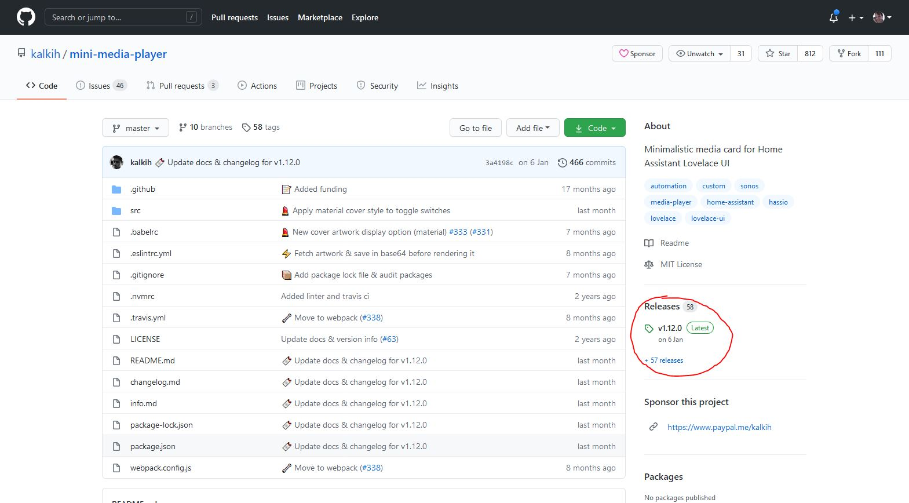
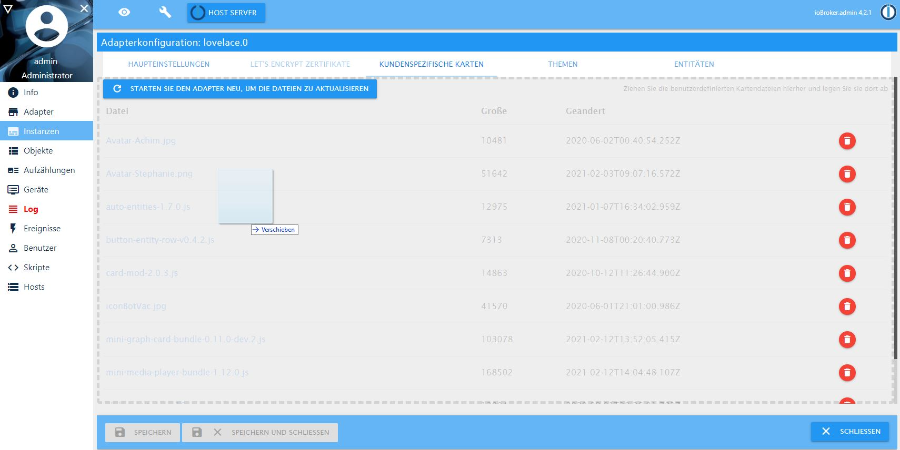
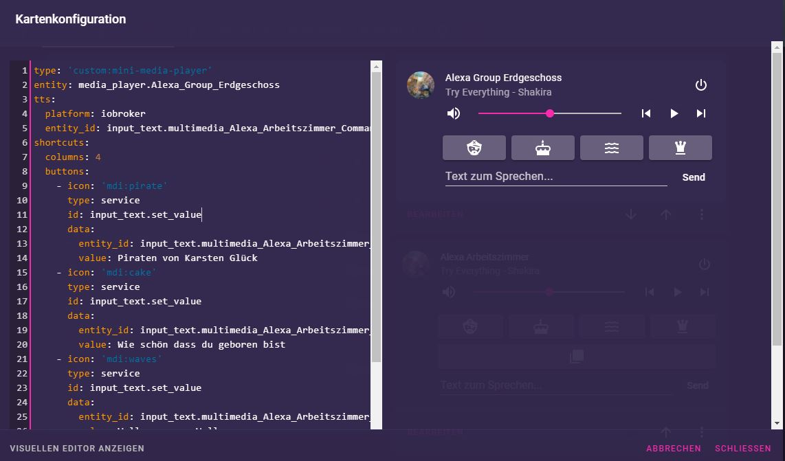

# Eigene Karten, Themes & UI-Tipps

* [Eigene Karten](#eigene-karten)
* [Eigene Bilder](#eigene-bilder)
* [Themes](#themes)
* [Icons](#icons)
* [UI-Tipps](#ui-tipps)

## Eigene Karten
Lovelace lässt sich gut durch selbst erstellte Karten (`Custom Cards`) erweitern. Diese kommen als JavaScript-Datei (*.js), die über die Konfiguration hochgeladen werden muss (Reiter `Eigene Karten` im Admin oder Drag & Drop in den Instanzeinstellungen).

Über die Kommandozeile (dort, wo iobroker installiert ist):

```iobroker file write PFAD_ZUR_DATEI\bignumber-card.js /lovelace.0/cards/```

Nach einem Neustart des Lovelace-Adapters werden alle Dateien aus dem `cards`-Verzeichnis automatisch eingebunden.

Benötigt eine Karte zusätzliche Ressourcen (CSS- oder JS-Dateien), muss die Ordnerstruktur im `cards`-Verzeichnis nachgebildet werden. Der Adapter erkennt URLs, die mit `/hacsfiles/` beginnen, und leitet sie auf das `cards`-Verzeichnis um. Bei `404`-Fehlern für `/hacsfiles/`-URLs entsprechend die Ordnerstruktur anpassen. Eine Karte, die z. B. `/hacsfiles/folder1/folder2/file3.json` braucht, muss unter `/lovelace.0/cards/folder1/folder2/file3.json` liegen.

Oft liegen Custom Cards auf GitHub als Quellcode und müssen vor der Nutzung kompiliert werden. Bevorzugt die im `Releases`-Menü auf GitHub bereitgestellten, kompilierten Dateien nutzen, z. B. [mini-graph-card Releases](https://github.com/kalkih/mini-graph-card/releases) (Datei `mini-graph-card-bundle.js`).




### Getestete Karten
Die folgenden Karten wurden vom Entwickler oder der Community getestet und funktionieren. Grundsätzlich sollten die allermeisten Karten funktionieren; bei Problemen liegt es oft an einer Inkompatibilität zwischen Lovelace-Version und Karte, daher möglichst aktuelle Kartenversionen nehmen.

* **[Clockwork Card](https://github.com/barleybobs/ha-clockwork-card)** — ein aktuell funktionierender Fork (die ursprüngliche Version wird nicht mehr gepflegt). Konfiguration: siehe [Uhrzeit](#uhrzeit). Es gibt keinen Zeit-Sensor; die Zeit kommt vom Browser, daher ohne `entity_id` und mit Zeitzonen konfigurieren.
* **[Mini Media Player](https://github.com/kalkih/mini-media-player)** — ein sehr konfigurierbarer Mediaplayer, der auch [Text-to-Speech und Shortcut-Knöpfe](#mini-media-card-mit-text2speech-tts-und-musik-shortcuts) unterstützt.
* **[Mini Graph Card](https://github.com/kalkih/mini-graph-card)** — eine sehr konfigurierbare Karte für Sensordaten, die mehrere `entities` als Graphen oder Balkendiagramme anzeigen kann.

## Eigene Bilder
Eigene Bilder (z. B. für einen Hintergrund) können über denselben Dialog wie Custom Cards hochgeladen werden. Verwendung in der Lovelace-Konfiguration:

`background: center / cover no-repeat url("/cards/background.jpg") fixed`

oder

`background: center / cover no-repeat url("/local/custom_ui/background.jpg") fixed`

Mehr zum Hintergrund in Lovelace [hier](https://www.home-assistant.io/lovelace/views/#background).

## Themes
Themes können im Konfigurationsdialog von ioBroker definiert werden. Mit dem Frontend-Update 2026 hat sich die Theme-Behandlung geändert — siehe die [Theme-Migration](theme_migration.md). Beispiel:

```yaml
midnight:
  primary-color: '#5294E2'
  accent-color: '#E45E65'
  primary-text-color: '#FFFFFF'
  secondary-text-color: '#5294E2'
  primary-background-color: '#383C45'
  secondary-background-color: '#383C45'
  paper-card-background-color: '#434954'
  paper-item-icon-active-color: '#F9C536'
```

(Ein vollständiges Beispiel ist das [Midnight-Theme](https://community.home-assistant.io/t/midnight-theme/28598/2). Viele `paper-*`-Variablen des alten Systems sind veraltet — siehe die Migrations-Hinweise.)

## Icons
Icons in der Form `mdi:NAME` verwenden, z. B. `mdi:play-network`. Namen gibt es hier: https://pictogrammers.com/library/mdi/

## UI-Tipps

### Anpassen der Titelleiste
Die Titelleiste lässt sich mit der Erweiterung [card-mod](https://github.com/thomasloven/lovelace-card-mod) anpassen. Dazu folgende YAML-Beispiele zum eigenen Theme hinzufügen:

Glocke entfernen:
```yaml
  card-mod-theme: THEMENAME
  card-mod-root: |
    mwc-icon-button[label] { display: none; }
```

Suche und Assist entfernen:
```yaml
  card-mod-theme: THEMENAME
  card-mod-root: |
    mwc-icon-button[label] { display: none; }
    ha-icon-button[slot="actionItems"] { display: none; }
```

Suche, Assist und Punktmenü entfernen:
```yaml
  card-mod-theme: THEMENAME
  card-mod-root: |
    mwc-icon-button[label] { display: none; }
    ha-icon-button[slot] { display: none; }
```

Titelleiste vollständig verbergen: den State `lovelace.0.instances.hideHeader` auf `true` setzen (nach einem Reload wird die Titelleiste bei allen Browsern entfernt). Der State existiert auch pro Instanz, kann also pro Browser gesetzt werden.

#### Ein komplettes Theme, das aussieht wie das Standard-Theme, aber ohne Glocke
Die obigen Schnipsel funktionieren nur innerhalb eines Themes. Wer keines bauen möchte, kann dieses kleine, eigenständige Theme (`no-bell-icon`) nehmen: Es entspricht grob dem dunklen Standard-Look und entfernt die Glocke. In die Theme-Konfiguration einfügen und auswählen (z. B. über den State `lovelace.0.instances.set_theme`). Das Theme wird erst auswählbar, nachdem der Datenpunkt existiert und der Adapter neu gestartet wurde.

```yaml
no-bell-icon:
  primary-background-color: "#111111"
  card-background-color: "#1c1c1c"
  secondary-background-color: "#282828"
  primary-text-color: "#e1e1e1"
  secondary-text-color: "#9b9b9b"
  disabled-text-color: "#6f6f6f"
  divider-color: "rgba(225, 225, 225, .12)"

  input-label-ink-color: var(--primary-text-color)
  ha-color-form-background: var(--card-background-color)
  ha-color-form-background-hover: var(--light-primary-color)
  ha-color-form-background-disabled: var(--primary-background-color)
  wa-color-neutral-fill-normal: var(--ha-color-on-primary-normal)

  # Glocke in der Titelleiste ausblenden. Benötigt card-mod.
  # https://github.com/thomasloven/lovelace-card-mod
  card-mod-theme: no-bell-icon
  card-mod-root-yaml: |
    .: |
      mwc-icon-button[label] {
        display: none;
      }
```

### Mini-Media-Card mit Text2Speech (TTS) und Musik-Shortcuts
Die Mini-Media-Card unterstützt für smarte Lautsprecher (Echo, Google Home, …) eine Text-to-Speech-(TTS-)Eingabe sowie Shortcut-Knöpfe für Musikstücke / Sender. Für TTS wird ein Service verwendet, den ioBroker nicht ohne Weiteres unterstützt, daher ist eine ioBroker-spezifische Konfiguration nötig:

```yaml
tts:
  platform: iobroker
  entity_id: input_text.multimedia_Alexa_Arbeitszimmer_Commands_speak
```

`platform` muss auf `iobroker` stehen. Die `entity_id` muss auf ein vorhandenes Text-`entity` zeigen, das dann mit dem Text gefüllt wird — so lässt sich jedes beliebige ioBroker-System zur Sprachausgabe nutzen.

Die Knöpfe können jeden beliebigen Service-Call ausführen; für ioBroker funktioniert z. B.:

```yaml
shortcuts:
  columns: 4
  buttons:
    - icon: 'mdi:pirate'
      type: service
      id: input_text.set_value
      data:
        entity_id: input_text.multimedia_Alexa_Arbeitszimmer_Player_playSongAmazon
        value: Piraten von Karsten Glück
    - icon: 'mdi:cake'
      type: service
      id: input_text.set_value
      data:
        entity_id: input_text.multimedia_Alexa_Arbeitszimmer_Player_playSongAmazon
        value: Wie schön dass du geboren bist
```

`input_text.set_value` schreibt einen Text in einen Datenpunkt; im `data`-Teil ist `entity_id` das Text-`entity` und `value` der einzutragende Text.



### Uhrzeit
Die Uhrzeit lässt sich z. B. mit der [Clockwork Card](#getestete-karten) einbinden. Einen Zeit-Sensor gibt es nicht; die Zeit kommt vom Browser:

```yaml
type: 'custom:clockwork-card'
title: Zeit
locale: de-de
other_time:
  - Europe/Berlin
```

Wenn man den Block rechts nicht mag, kann man ihn zusammen mit der `card-mod`-Karte ausblenden:

```yaml
type: 'custom:clockwork-card'
title: Zeit
style: |
    .other_clocks { display: none }
locale: de-de
other_time:
    - Europe/Berlin
```

### Bindings (Markdown)
Die Markdown-Karte kann mit Bindings verwendet werden, wie in [ioBroker.vis](https://github.com/ioBroker/ioBroker.vis#bindings-of-objects) üblich.

Zum Beispiel erzeugt `Admin läuft{a:system.adapter.admin.0.alive;a === true || a === 'true' ? '' : ' nicht'}.` den Text `Admin läuft` in der Markdown-Karte. Zusätzlich können Home-Assistant-Templates (`{{ states("…") }}`, `is_state`, `state_attr`, `now()`, …) genutzt werden.
