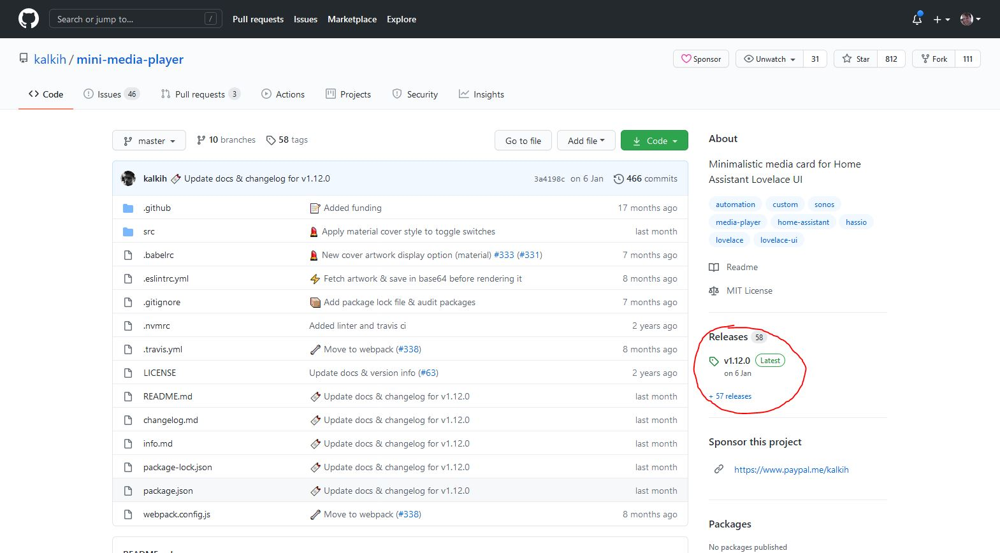
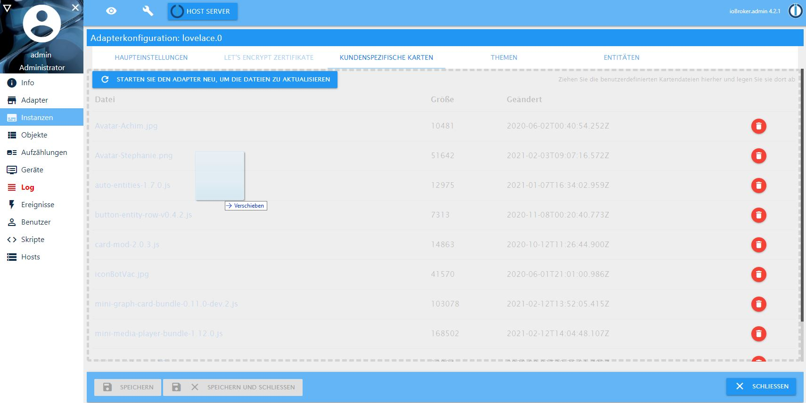

# Eigene Karten

Lovelace lässt sich gut durch selbst erstellte Karten (`Custom Cards`) erweitern. Diese kommen in Form einer Javascript Datei (*.js), die 
über die Konfiguration in lovelace hochgeladen werden muss (Reiter `Eigene Karten`). 
<!-- TODO: Screenshot! Auch Github Release! -->

## Getestete Karten

Die folgenden Karten sind vom Entwickler oder der Comunity getestet worden und funktionieren. Grundsätzlich sollten die
allermeisten Karten funktionieren. Wenn es Probleme gibt, kann es auch an einer Inkompatibilität zwischen der verwendeten
Lovelace Version und der Karte liegen. Ich versuche den Apter im Moment relativ aktuell zu halten, von daher sollte man
versuchen die möglichst neuesten Kartenversionen zu nehmen.

* [Installation](custom_cards.md#installation)
* [Clockork Card](custom_cards.md#clockwork-card)
* [Mini Media Player](custom_cards.md#mini-media-player)

### Installation

Um eine Karte installieren zu können, muss die dazu gehörende Javascript (*.js) Datei heruntergeladen werden. Diese gibt
es meist in einem Github Repository. Oft findet man in diesen Repositories definierte Releases, diese sollten bevorzugt 
genommen werden, siehe im Bild.


Diese Javascript Datei muss per Drag & Drop in die Dateiliste in den Instanzeinstellungen im Reiter "Eigene Karten" gezogen werden,
siehe Screenshot.


### Clockwork Card

Repository: https://github.com/barleybobs/ha-clockwork-card (es handelt sich um einen aktuell funktionierenden Fork, die ursprüngliche
Version wird nicht mehr gepflegt). 

Besonderheiten zur Konfiguration, [siehe hier](ui_tipps.md#Uhrzeit).

<!-- Einen `sensor` für die Zeit kann man sich mit einem Skript selber bauen, z.B. so:
`````javascript
schedule('* * * * *', () => {
    setState('0_userdata.0.zeit', Date.now());
});
`````-->
Die Konfiguration muss ohne entity_id und dafür mit Zeitzonen sein. Die Zeit kommt dann vom Browser selber, so in etwas:
`````yaml

`````

### Mini Media Player

Repository: https://github.com/kalkih/mini-media-player

Ein sehr konfigurierbarer Mediaplayer, der auch [Text to Speech und Shortknöpfe unterstützt](ui_tipps.md#mini-media-card-mit-text2speech-tts-und-musik-shortcuts).

### Mini Graph Card

Repository: https://github.com/kalkih/mini-graph-card

Eine sehr konfigurierbare Karte für Sensordaten, die mehrere `entities` mit Graphen oder Balkendiagrammen anzeigen kann.
