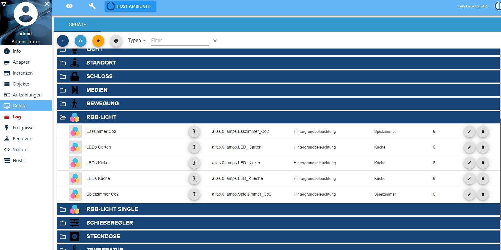
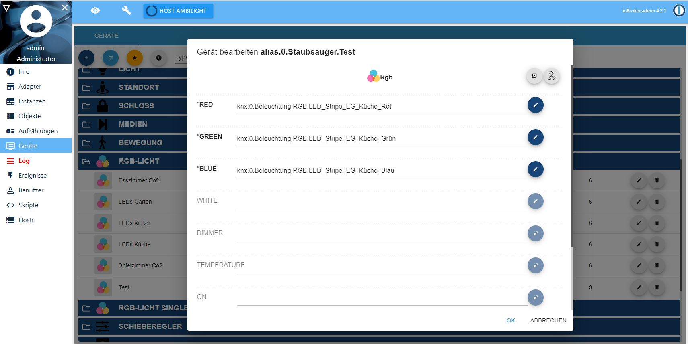
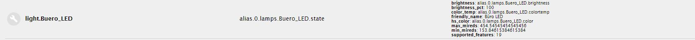
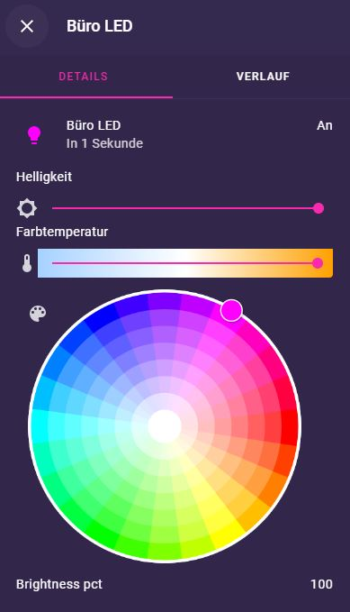
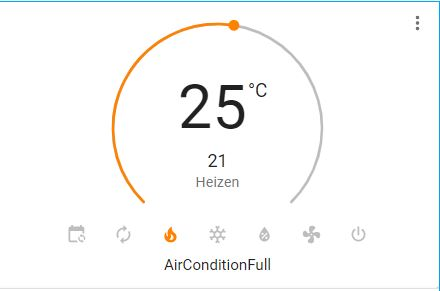
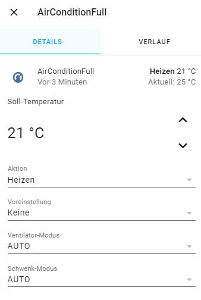
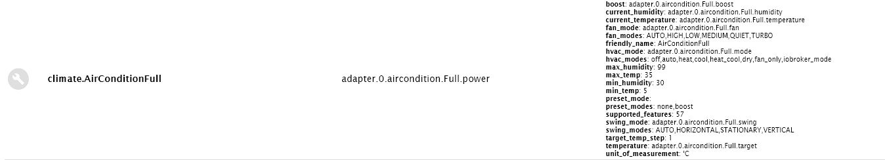

# Entitäten

Es gibt zwei Wege, ioBroker-Objekte in Home-Assistant-`entities` zu verwandeln:
1. [Automatische Erkennung](#automatische-erkennung) (bevorzugt)
2. [Manuelle Konfiguration](#manuelle-konfiguration)

Weiter unten finden sich die [unterstützten Entity-Typen](#unterstützte-entity-typen) und einige [besondere Entitäten](#besondere-entitäten) (Alarm, Timer, Wetter, Karte, …).

## Automatische Erkennung
Dieser Weg ist immer zu bevorzugen, wenn möglich. Für die Erkennung wird die ioBroker-Bibliothek `type-detector` genutzt. Diese ist auch in anderen Adaptern wie `iot` oder `material` in Verwendung. Wenn die Geräte für einen dieser Adapter sauber konfiguriert sind, profitieren gleich mehrere.

Mittlerweile gibt es mit dem [Geräte-Adapter](https://github.com/iobroker/iobroker.devices) auch eine UI für den `type-detector`. Es wird dringend empfohlen, diesen Adapter zu installieren und den Tab im Admin zu aktivieren. Dort tauchen alle erkannten Geräte auf, die potenziell auch in Lovelace verwendet werden können.



Für die Erkennung ist es wichtig, dass die States der Geräte die richtigen Rollen und Typen (Nummer, String, Boolean, …) haben. Ist das nicht der Fall, empfiehlt es sich, mit der Alias-Funktion des js-Controllers ein Gerät zusammenzustellen. Am einfachsten geht das ebenfalls im *Geräte-Tab* im Admin: dort kann für jeden State eines Geräts ein vorhandenes Objekt ausgewählt werden, und die Rollen und anderen Eigenschaften werden beim Alias direkt richtig gesetzt, sodass die Erkennung funktioniert.

Nachdem Ordner, Typ, Raum und Funktion angegeben wurden, werden die einzelnen States so zugewiesen:


Lovelace erkennt alle Geräte, die im Geräte-Tab dargestellt werden und die Raum **und** Funktion zugewiesen haben. Geräte, bei denen eins von beiden fehlt, werden ignoriert.

In den Instanzeinstellungen sieht man bei komplexeren Objekten, dass mehrere States zu einer `entity` zusammengesetzt werden, ein Beispiel:


Zu sehen ist ein Licht (`light`), das Farbe, Farbtemperatur und Dimmen unterstützt — insgesamt 4 ioBroker-States in einem Objekt.

## Manuelle Konfiguration
In der Objektansicht (die `custom`-Einstellungen eines ioBroker-Objekts) kann Lovelace für einzelne Datenpunkte aktiviert werden. Dabei werden die `Domäne` (`light`, `input_boolean`, …) und ein Name eingestellt.

Einfache Ein-State-Entitäten (z. B. `input_number`, `input_text`, `input_boolean`) funktionieren direkt. Zusätzlich lassen sich über Objekt-Auswahlfelder im Custom-Dialog auch mehrteilige Entitäten konfigurieren — z. B. ein `cover` (etwa ein automatisches Fenster), `device_tracker` und `person`. Für diese Typen wählt man die ioBroker-States je Rolle (z. B. Cover `SET`/`ACTUAL`/`OPEN`/`CLOSE`/`STOP`, oder Tracker Anwesenheit / GPS) und der Adapter nutzt die volle Entity-Logik.

Für komplexere Geräte (z. B. Lichter mit Dimm- und Farbfunktionen) wird die automatische Erkennung dringend empfohlen. Auch für (binäre) Sensoren sollte man die automatische Erkennung nutzen, da dann das Attribut `device_class` gefüllt wird und die Darstellung besser zum Gerät passt (z. B. wird ein binärer Sensor vom Typ „Tür“ als „Tür“ dargestellt und an/aus in offen/zu übersetzt).

#### Wo man die Einstellungen aktiviert und was der Entity-State ist
Bei **einfachen** Ein-State-Typen (`input_number`, `input_text`, `input_boolean`, `input_select`, `switch`, `sensor`, `binary_sensor`, `camera`, `timer`, `alarm_control_panel`) aktiviert man die Custom-Einstellungen **am State selbst** — der Wert dieses Objekts *ist* der Entity-State.

Bei den **mehrteiligen** Typen wählt man die ioBroker-States je Rolle im Custom-Dialog. Das Objekt, an dem man die Einstellungen aktiviert, ist nur der **Anker** (es gibt der Entity ID und Anzeigenamen); sein eigener Wert wird **nicht** gelesen — alle funktionalen States werden über die Auswahlfelder zugeordnet. Man kann die Einstellungen also an einem beliebigen State des Geräts ablegen (z. B. am Soll-Temperatur-State eines Thermostats).

`SET` ist immer der **Soll-/Zielwert** (ein Sollwert, eine Rollladen-Position), nicht der Entity-State. Der Entity-State (der Hauptwert auf der Karte) je Typ:

| Domain | Rollen (Picker) | Entity-State |
|---|---|---|
| `light` | `ON` (an/aus), `ON_ACTUAL`, `DIMMER` (Helligkeit), `TEMPERATURE` (Farbtemp.), `RGB`, `HUE`, `SATURATION`, `EFFECT` | `on` / `off` |
| `cover` | `SET` (Pegel), `ACTUAL`, `OPEN`/`CLOSE`/`STOP`, `TILT_SET`/`TILT_ACTUAL` | `open` / `closed` / `opening` / `closing` |
| `climate` | `SET` (Soll-Temp.), `ACTUAL` (Ist-Temp.), `MODE` (HVAC-Modus), `POWER` (an/aus), `HUMIDITY`, `SPEED`, `SWING`, `BOOST`, `PARTY`; eine *Heizen/Kühlen*-Auswahl erscheint, wenn kein `MODE` zugeordnet ist | der HVAC-Modus: `heat` / `cool` / `off` |
| `lock` | `SET` (ver-/entriegeln), `ACTUAL`, `OPEN` (Türöffner) | `locked` / `unlocked` |
| `media_player` | `STATE`, `POWER`, `PLAY`/`PAUSE`/`STOP`/`NEXT`/`PREV`, `VOLUME`/`VOLUME_ACTUAL`/`MUTE`, `SEEK`/`REPEAT`/`SHUFFLE`, `TITLE`/`ARTIST`/`COVER`/`DURATION`/`ELAPSED` | `playing` / `paused` / `idle` |
| `vacuum` | `STATE` (Status), `POWER` (Start/Stopp), `PAUSE`, `BATTERY`, `WORK_MODE` (Lüfterstufe) | `cleaning` / `docked` / `paused` / `returning` / `idle` / `error` |
| `humidifier` | `POWER` (an/aus), `SET` (Soll-Feuchte), `ACTUAL` (Ist-Feuchte), `MODE` | `on` / `off` |
| `water_heater` | `SET` (Soll-Temp.), `ACTUAL` (Ist-Temp.), `POWER` (an/aus), `MODE` (Betriebsmodus) | der Betriebsmodus |
| `device_tracker` / `person` | Anwesenheit, GPS (`"lat;lon"` oder getrennt Breite/Länge), GPS-Genauigkeit, Batterie, Bild (URL oder State), Quellentyp | `home` / `not_home` / ein Zonenname |

### Alarm-Panel
ioBroker unterstützt ein solches Gerät noch nicht, es lässt sich aber simulieren, z. B. mit diesem Skript:

```js
createState(
    'alarmSimple',
    false,
    false,
    {
        "name": "alarmSimple",
        "role": "alarm",
        "type": "boolean",
        "read": true,
        "write": true,
        "desc": "Arm or disarm with code",
        "def": false,
        "custom": {
            "lovelace.0": {
                "enabled": true,
                "entity": "alarm_control_panel",
                "name": "simulateAlarm" // Entity-Name -> "alarm_control_panel.simulateAlarm"
            }
        }
    },
    {
        "alarm_code": 1234 // Alarmcode, der eingegeben werden muss
    },
    function () {
        on({id: 'javascript.' + instance + '.alarmSimple', change: 'any'}, function (obj) {
            console.log('Hier das echte Gerät steuern: ' + obj.state.val);
        });
    }
);
```

oder man verwendet einfach `lovelace.X.control.alarm (entity_id = alarm_control_panel.defaultAlarm)`.

### Zahleneingabe (input_number)
Im Custom-Dialog den Typ `input_number` wählen. Es werden `min` und `max` in `common` benötigt; ein optionales `step` kann ergänzt werden. Für Pfeil-Knöpfe statt Slider `mode` auf `number` setzen:

```json5
common: {
    custom: {
        "lovelace.0": {
            "enabled": true,
            "entity": "input_number",
            "name": "Shutter", // Entity-Name -> "input_number.Shutter"
            "mode": "number" // Standard ist Slider
        }
    }
}
```

### Auswahl (input_select)
Im Custom-Dialog den Typ `input_select` wählen. Die Auswahlliste kommt aus dem Standard-`common.states`-Objekt:

```json
"common": {
    "type": "string",
    "states": {
      "1": "select 1",
      "2": "Select 2",
      "3": "select 3"
    },
    "custom": {
      "lovelace.0": {
        "enabled": true,
        "entity": "input_text",
        "name": "test_input_select"
      }
    }
```

### Timer
Ein Timer lässt sich mit folgendem Skript simulieren:

```js
createState(
    'timerSimple',
    false,
    false,
    {
        "name": "timerSimple",
        "role": "level.timer",
        "type": "number",
        "read": true,
        "write": true,
        "unit": "sec",
        "desc": "Start/Stop Timer",
        "def": 0,
        "custom": {
            "lovelace.0": {
                "enabled": true,
                "entity": "timer",
                "name": "simulateTimer" // Entity-Name -> "timer.simulateTimer"
            }
        }
    },
    {},
    function () {
        let interval;
        let id = 'javascript.' + instance + '.timerSimple';
        on({id, change: 'any'}, function (obj) {
            if (!obj.state.ack) {
                if (obj.state.val) {
                    if (obj.state.val === obj.oldState.val) {
                        if (interval) {
                            setState(id, state.val, true);
                            clearInterval(interval);
                            interval = null;
                        } else {
                            interval = setInterval(() => {
                                getState(id, (err, state) => {
                                    state.val--;
                                    if (state.val <= 0) { clearInterval(interval); interval = null; state.val = 0; }
                                    setState(id, state.val, true);
                                });
                            }, 1000);
                        }
                    } else {
                        interval && clearInterval(interval);
                        interval = setInterval(() => {
                            getState(id, (err, state) => {
                                state.val--;
                                if (state.val <= 0) { clearInterval(interval); interval = null; state.val = 0; }
                                setState(id, state.val, true);
                            });
                        }, 1000);
                    }
                } else {
                    interval && clearInterval(interval);
                    interval = null;
                }
            }
        });
        setTimeout(() => setState(id, 20));
    }
);
```

## Unterstützte Entity-Typen
Die folgenden Entity-Typen werden vom Adapter angelegt oder können manuell konfiguriert werden. Angegeben ist jeweils die `Domain` (der Teil, mit dem die entity beginnt, z. B. `light` bei `light.kueche`) und die ioBroker-Geräte, die bei automatischer Erkennung zu diesem entity führen.

### Licht
Domain: `light`

ioBroker-Geräte: Licht (`light`), Dimmer (`dimmer`), Farbtemperatur (`ct`), RGB-Licht (`rgb`), RGB-Single (`rgbSingle`), HUE-Licht (`hue`).

ioBroker sortiert Lampen je nach Fähigkeiten in unterschiedliche Geräteklassen ein — drei davon für farbiges Licht (`rgb`, `rgbSingle`, `hue`), optional zusätzlich mit Dimmer oder Farbtemperatur. Es wird immer die Klasse mit den meisten Fähigkeiten genommen. Bei der manuellen Konfiguration ist aktuell nur an/aus und ggf. dimmen möglich; Lichter mit erweiterten Fähigkeiten benötigen die automatische Erkennung.




### Sensoren
Domain: `sensor`

ioBroker-Geräte: Fensterkippung (`windowTilt`), Feuchtigkeit (`humidity`), Temperatur (`temperature`).

Obwohl Sensoren meist nur aus einem ioBroker-State bestehen (manuelle Konfiguration also möglich wäre), empfiehlt sich die automatische Erkennung, da dann `device_class` richtig gefüllt wird und Lovelace z. B. das richtige Icon und die richtige Einheit setzt.

### Klima
Domain: `climate`

ioBroker-Geräte: Thermostat (`thermostat`), Klimaanlage (`airCondition`).



Die Temperatur wird in Lovelace über einen runden Slider gesteuert. Darunter gibt es Knöpfe zur Wahl des Modus (nur bei bekannten Modi). Die Modi werden mittels `states` im ioBroker-State auf Zahlen abgebildet. Lovelace kennt `auto`, `heat`, `cool`, `heat_cool`, `dry`, `fan_only` und `off`; diese werden als übersetzte Schaltflächen angezeigt. Abweichende States erscheinen im More-Info-Fenster als Dropdown, dort gibt es auch Dropdowns für Presets (falls `boost` oder `party` im ioBroker-Gerät vorhanden) sowie Ventilator / Swing, falls erkannt (deren States werden 1:1 angezeigt).




## Besondere Entitäten

### Wetter
Getestet mit `yr` und `daswetter`. Eines oder mehrere der folgenden Objekte müssen `Funktion=Wetter` und `Raum=beliebig` gesetzt haben, um in der Konfiguration verfügbar zu sein:
- `daswetter.0.NextDays.Location_1`
- `yr.0.forecast`

Getestet mit dem `AccuWeather`-Treiber v1.1.0 (https://github.com/iobroker-community-adapters/ioBroker.accuweather). Eigene Lovelace-Karte zur AccuWeather-Vorhersage: https://github.com/algar42/IoB.lovelace.accuweather-card

### Einkaufsliste
Die Einkaufsliste schreibt ihre Werte in den State `lovelace.X.control.shopping_list` in dieser Form:
```json
[
   {"summary": "Task 1", "uid": "1234222", "status": "needs_action"},
   {"summary": "Task 2", "uid": "1234223", "status": "completed"}
]
```
Eigene Todo- oder Einkaufslisten können auch über manuelle Entitäten vom Typ `todo` angelegt werden.

### Karte / Anwesenheit
Die Karte zeigt Objekte wie dieses:

```js
createState('location', '39.5681295;2.6432632', false, {
    "name": "location",
    "role": "value.gps",
    "type": "string",
    "read": true,
    "write": false,
    "desc": "Gps Coordinates"
});
```

oder zwei getrennte Objekte mit den Rollen `value.gps.longitude` und `value.gps.latitude`.

Für einen Personen-/Anwesenheits-Marker auf der Karte ordnet man ein ioBroker-Objekt einer manuellen `device_tracker`- oder `person`-Entität zu (siehe [Manuelle Konfiguration](#manuelle-konfiguration)).

### Bild-Entität
Ein statisches Bild oder ein State, der eine URL liefert:

```json
{
  "_id": "daswetter.0.NextDays.Location_1.Day_1.iconURL",
  "type": "state",
  "common": {
    "name": "Weather icon URL",
    "type": "string",
    "role": "weather.icon.forecast.0",
    "read": true,
    "write": false
  },
  "native": {}
}
```

oder einfach den Entity-Typ `camera` setzen und die URL hineinschreiben. Für Video / Live-Streams siehe [Funktionen → Video](features.md#video--live-stream-anzeigen).
