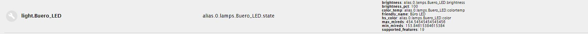
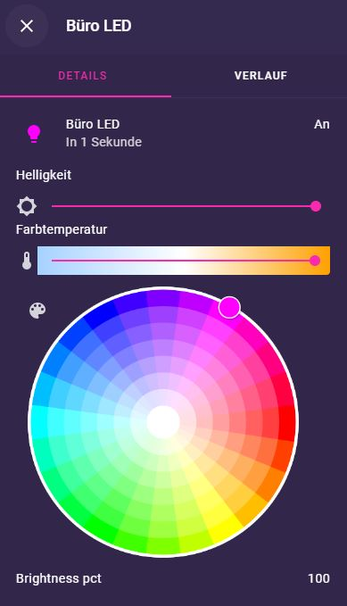
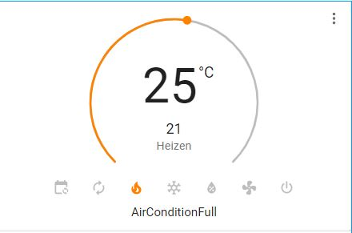
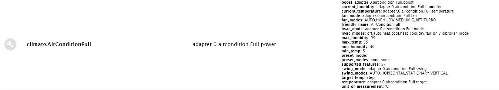

# Unterstützte Entities

Die folgenden Entities werden vom Adapter angelegt oder können manuell konfiguriert werden.
Angegeben ist jeweils die `Domain`, also der Teil mit der der entity in Lovelace anfangen wird (z.B. `light` bei 
entity `light.kueche`), die ioBroker Geräte, die bei automatischer Erkennung zu diesem entity führen. 

## Inhalt

* [Licht](supported_entities.md#licht)
* [Sensoren](supported_entities.md#sensoren)
* [Thermostat/AirCondition](supported_entities.md#klima)

## Licht

Domain: `light`

ioBroker Geräte:
* Licht (`light`)
* Dimmer (`dimmer`)
* Farbtemperatur (`ct`)
* RGB Licht (`rgb`)
* RGB-Licht Single (`rgbSingle`)
* HUE-Licht (`hue`)

ioBroker ist hier etwas besonders und sortiert die Lampen, je nach Fähigkeiten in sehr unterschiedliche Geräteklassen ein. So
gibt es drei Klassen für Lampen, die farbiges Licht erzeugen können (`rgb`, `rgbSingle`, `hue`). Natürlich können diese
zusätzlich (optional) einen Dimmer oder die Farbtemperatur-Einstellung haben. Es wird immer die Klasse mit den meisten
Fähigkeiten genommen.
Bei der manuellen Konfiguration ist aktuell nur an/aus und ggf. dimmen möglich. Lichter mit den erweiterten Fähigkeiten 
benötigen zwingend die automatische Erkennung.

Ein Beispiel eines komplexen Lichts in Lovelace (more-info Karte):

## Sensoren

Domain: `sensor`

ioBroker Geräte:
* Fensterkippung (`windowTilt`)
* Feuchtigkeit (`humidity`)
* Temperatur (`temperature`)

Obwohl Sensoren meist nur aus einem ioBroker-State bestehen und daher grundsätzlich auch die manuelle Konfiguration in Frage
kommt, empfiehlt sich trotzdem die automatische Erkennung zu nutzen, da dann das Attribut `device_class` (Geräteklasse) 
richtig gefüllt werden kann und Lovelace so z.B. das richtige Icon und die richtige Einheit setzt.

## Klima

Domain: `climate`

ioBroker Geräte:
* Thermostat (`thermostat`)
* AirCondition (`airCondition`)

Thermostate und Klimaanlagen unterstützt Lovelace mit dem entity `climate`. Die Geräte `thermostat` und `airCondition` werden
beide erkannt und in ein `climate` Gerät übersetzt. Dabei unterscheiden sich die Geräte zwischen ioBroker und Lovelace zum 
Teil deutlich. 

Die Kontrolle der Temperatur erfolgt in Lovelace über einen runden Slider. Darunter gibt es Knöpfe zur Wahl 
des Modus (geht nur bei bekannten Modi). Die Modi werden mittels `states` im ioBroker state auf Zahlen umgebogen. Lovelace kennt 
`auto`, `heat`, `cool`, `heat_cool`, `dry`, `fan_only` und `off`. Diese werden als Schaltflächen angezeigt und übersetzt. Davon
abweichende States werden im more-info Fenster als Dropdown angezeigt. Dort gibt es auch dropdowns für Presets (falls `boost` oder `party` 
im ioBroker Gerät vorhanden ist) oder Ventilator / Swing, falls das im ioBroker Gerät erkannt wurde. Bei Ventilator und Swing werden
die States 1:1 in Lovelace angezeigt.

Wie man an den Attributen sieht, sind da sehr viele ioBroker states an einer "vollausgestateten" Klimakarte beteiligt:

<!-- [Types.socket]:                 processSocket.bind(this),
            [Types.motion]:                 processBinarySensors.processMotion.bind(this),
            [Types.window]:                 processBinarySensors.processWindow.bind(this),
            [Types.door]:                   processBinarySensors.processDoor.bind(this),
            [Types.button]:                 processSocket.bind(this),
            [Types.lock]:                   processLock.bind(this),
            [Types.thermostat]:             processThermostatOrAirConditioning.bind(this),
            [Types.blind]:                  processBlind.bind(this),
            [Types.blindButtons]:           processBlind.bind(this),
            [Types.weatherForecast]:        converterWeather.processWeather.bind(this),
            [Types.accuWeatherForecast]:    converterWeather.processAccuWeather.bind(this),
            [Types.location]:               processLocation.bind(this),
            [Types.location_one]:           processLocation.bind(this),
            [Types.media]:                  processMediaPlayer.bind(this),
            [Types.image]:                  processImage.bind(this),
-->
