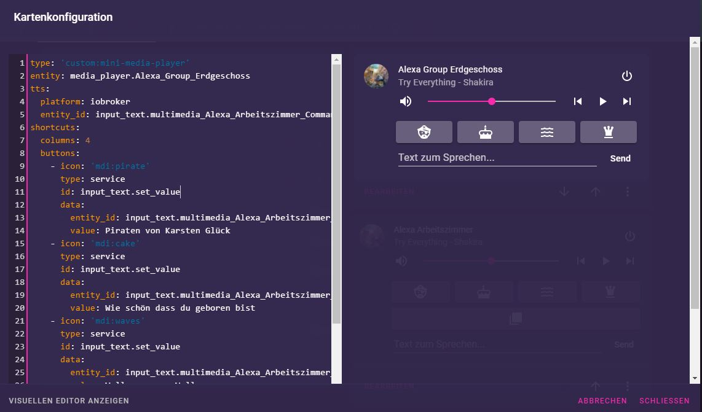

# Tipps für die Gestaltung der Oberfläche

## Inhalt 

* [Titelleiste verbergen](ui_tipps.md#titelleiste-vollständig-verbergen)
* [Mini Media Card mit TTS und Shortcuts](ui_tipps.md#mini-media-card-mit-text2speech-tts-und-musik-shortcuts)
* [Uhrzeit](ui_tipps.md#uhrzeit)
* [Bindings](ui_tipps.md#bindings)

## Titelleiste vollständig verbergen

Um einen Kioskmodus oder ähnliches zu erreichen und auch die Auswahl der Taps verschwinden zu lassen, kann der folgende YAML 
Code zum eigenen Theme hinzugefügt werden:

```yaml
  card-mod-theme: THEMENAME
  card-mod-root: |
  app-toolbar {
    display: none;
  }
```
Das muss Teil des Themes sein, also z.B. so:

<details>
  <summary>Beispiel Theme</summary>


```yaml
synthwave:
  # text
  primary-text-color: '#fff'
  secondary-text-color: '#ffffffca'
  text-primary-color: '#f4eee4'
  disabled-text-color: '#bdbdbd'

  # main interface colors
  primary-color: '#f92aad'
  primary-background-color: '#2a2139'
  dark-primary-color: '#f92aad'
  light-primary-color: '#241b2f'
  accent-color: '#f92aad'
  divider-color: '#49549539'
  paper-dialog-button-color: '#fff'
  switch-unchecked-button-color: '#fff'
  # iron-icon-fill-color: '#fff'
  yellow: '#ffcc00'
  green: '#72f1b8cc'
  
  ###
  
  # background and sidebar
  card-background-color: '#34294fe6'
  app-header-background-color: 'var(--primary-background-color)'
  paper-card-background-color: 'var(--card-background-color)'
  secondary-background-color: 'var(--light-primary-color)' # behind the cards on state
  ha-card-border-radius: '8px'
  
  # sidebar menu
  sidebar-text-color: 'var(--secondary-text-color)'
  # sidebar-background-color: 'var(--paper-listbox-background-color)' # backward compatible with existing themes
  sidebar-icon-color: 'var(--secondary-text-color)'
  sidebar-selected-text-color: 'var(--primary-text-color)'
  sidebar-selected-icon-color: 'var(--primary-text-color)'
  
  # mwc - for some reason it's buttons
  mdc-theme-primary: 'var(--dark-primary-color)'
  mdc-theme-secondary: 'var(--dark-primary-color)'
  
  # shadows
  ha-card-box-shadow: '0'

  # icons
  paper-item-icon-color: 'var(--secondary-text-color)'  # Off
  paper-item-icon-active-color: 'var(--yellow)' # On

  # switches
  toggle-button-color: 'var(--primary-color)'
  # --toggle-button-unchecked-color: 'var(--accent-color)'
  paper-toggle-button-checked-button-color: 'var(--primary-text-color)' # Knob On
  paper-toggle-button-checked-bar-color: 'var(--dark-primary-color)' # Background On
  switch-checked-color: 'var(--dark-primary-color)' # Background On
  paper-toggle-button-unchecked-button-color: 'var(--primary-text-color)' # Knob Off
  paper-toggle-button-unchecked-bar-color: 'var(--disabled-text-color)' # Background Off

  # Sliders
  slider-color: 'var(--primary-color)'
  slider-secondary-color: 'var(--light-primary-color)'
  slider-bar-color: 'var(--disabled-text-color)'
  paper-slider-knob-color: 'var(--accent-color)'
  paper-slider-knob-start-color: 'var(--accent-color)'
  paper-slider-pin-color: 'var(--accent-color)'
  paper-slider-active-color: 'var(--dark-primary-color)'
  # paper-slider-container-color: 'linear-gradient(var(--primary-background-color), var(--secondary-background-color)) no-repeat'
  paper-slider-secondary-color: 'var(--secondary-background-color)'
  paper-slider-disabled-active-color: 'var(--disabled-text-color)'
  paper-slider-disabled-secondary-color: 'var(--disabled-text-color)'
  switch-unchecked-track-color: 'var(--primary-text-color)'

  # radio buttons
  paper-radio-button-checked-color: 'var(--paper-toggle-button-checked-button-color)'
  paper-radio-button-unchecked-color: 'var(--paper-toggle-button-unchecked-button-color)'

  # other
  state-icon-color: 'var(--green)'
  table-row-background-color: 'var(--divider-color)'
  table-row-alternative-background-color: 'var(--light-primary-color)'
  
  ###

  # UI
  paper-card-header-color: 'var(--text-primary-color)' # Title in settings

  # Left Menu
  paper-listbox-background-color: 'var(--light-primary-color)' # Background
  sidebar-background-color: 'var(--light-primary-color)'

  # bar-card compatibility
  # https://github.com/custom-cards/bar-card
  custom-bar-card-color: 'var(--accent-color)'

  # fix dropdown background
  material-background-color: 'var(--light-primary-color)'

  # Scrollbar
  scrollbar-thumb-color: 'var(--divider-color)'

  # simple-thermostat buttons
  # https://github.com/nervetattoo/simple-thermostat
  st-mode-background: 'var(--primary-background-color)'
  st-mode-active-background: 'var(--dark-primary-color)'
  
  card-mod-theme: synthwave
  card-mod-root: |
  app-toolbar {
      display: none;
  }


```

</details>


## Mini-Media-Card mit Text2Speech (TTS) und Musik-Shortcuts

Die Mini-Media-Card unterstützt für Smarte-Lautsprecher (Echo, Google Home, ...) eine Text to Speech (TTS) Eingabe. Zusätzlich kann
man Shortcut Knöpfe für Musikstücke / Sender o.ä. anlegen. Leider wird für TTS ein Service verwendet, den ioBroker so nicht
ohne weiteres unterstützt, also ist hier eine ioBroker spezifische Konfiguration notwendig, tts geht so:

````yaml
tts:
  platform: iobroker
  entity_id: input_text.multimedia_Alexa_Arbeitszimmer_Commands_speak
````

`platform` muss dabei auf `iobroker` gesetzt werden. Die `entity_id` muss auf ein (existierendes) `entity` zeigen, 
was dann mit dem Text gefüllt wird. Damit lässt sich also in ioBroker jedes beliebige System zur Sprachausgabe nutzen.

Die Knöpfe können mit jedem beliebigem Service-Call gefüllt werden, gut klappt für ioBroker so etwas:
````yaml
shortcuts:
  columns: 4
  buttons:
    - icon: 'mdi:pirate'
      type: service
      id: input_text.set_value
      data:
        entity_id: input_text.multimedia_Alexa_Arbeitszimmer_Player_playSongAmazon
        value: Piraten von Karsten Glück
    - icon: 'mdi:cake'
      type: service
      id: input_text.set_value
      data:
        entity_id: input_text.multimedia_Alexa_Arbeitszimmer_Player_playSongAmazon
        value: Wie schön dass du geboren bist
    - icon: 'mdi:waves'
      type: service
      id: input_text.set_value
      data:
        entity_id: input_text.multimedia_Alexa_Arbeitszimmer_Player_playSongAmazon
        value: Wellerman von Wellermen
    - icon: 'mdi:chess-queen'
      type: service
      id: input_text.set_value
      data:
        entity_id: input_text.multimedia_Alexa_Arbeitszimmer_Player_playSongAmazon
        value: Let it go von Idina Menzel
````

Dabei wird mit `input_text.set_value` angegeben, dass ein Text in einen Datenpunkt geschrieben werden soll. Im `data` Teil
wird dann mit `entity_id` wieder die Text `entity` angegeben und mit `value` der Text, der eingetragen werden soll.

Das Ergebnis sieht dann so etwa aus:


## Uhrzeit

Die Uhrzeit lässt sich z.B. mit der [Clockwork-Card](custom_cards.md#clockwork-card) einbinden.
Einen Zeit-Sensor gibt es nicht. Vielleicht kann man sich einen mit einem Javascript zusammen bauen, allerdings wird 
dann jede Minute relativ viel Aufwand getrieben. Die Uhrzeit hat der Browser selber und die wird mit folgender Konfiguration 
verwendet:
````yaml
type: 'custom:clockwork-card'
title: Zeit
locale: de-de
other_time:
  - Europe/Berlin
````
Wenn man den Block rechts nicht mag, kann man ihn, zusammen mit der `card mod card` ausblenden:
````yaml
type: 'custom:clockwork-card'
title: Zeit
style: |
    .other_clocks {
      display: none
    }
locale: de-de
other_time:
    - Europe/Berlin
````

## Bindings

Die Markdown-Karte kann mit Bindings verwendet werden. Dabei ist die Konfiguration, wie in [ioBroker.vis](https://github.com/ioBroker/ioBroker.vis#bindings-of-objects) üblich.

Zum Beispiel erzeugt der Text `Admin läuft{a:system.adapter.admin.0.alive;a === true || a === 'true' ? '' : ' nicht'}.` den text `Admin läuft` in der Markdown-Karte.
